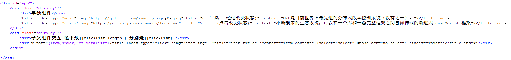
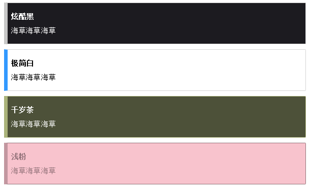

HashYeah's arsenal
===

HashYeah web components developed independently

这是我在重构自己的博客网站时开发的一些基于Vue 2.0的HTML5的组件，希望能帮助到你。

Title-index(标题索引DIV组件)
---

  
  

一款扁平化的标题-图像-简介Html5组件。

使用场景:导航、下载

该组件有两种状态方案：
1.鼠标经过改变状态
2.鼠标点击改变状态

目前有两个版本 一个原生js版，一个Vue版.

Title-index-pure
---

  

引言功能的组件

使用场景:导航、简介

主题颜色以后需要再扩充
